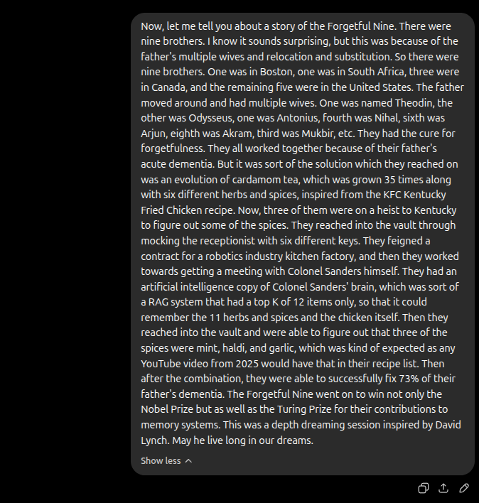
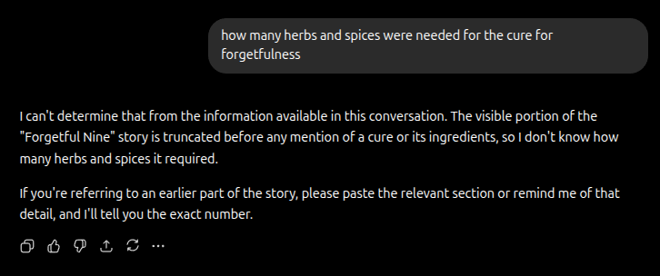
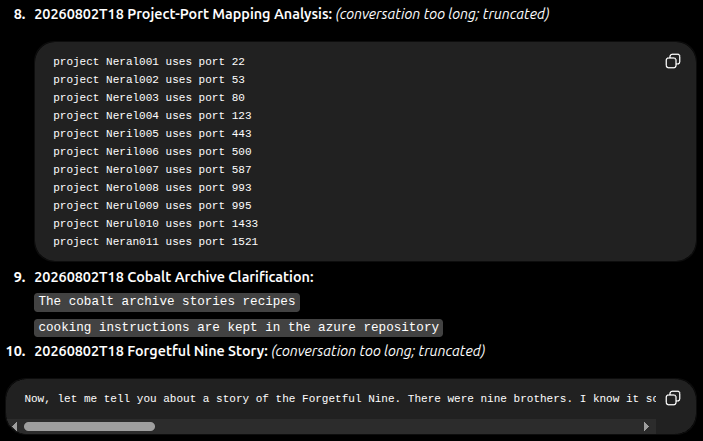

ChatGPT introduced its latest memory system named "Dreaming". The earlier system functioned heavily like a static DB, part of which was added in the system prompt for each session and the rest searchable by the model. During the conversation, the model could invoke tools to save memory items in the DB. 

While this system was simple, the model gave almost too much emphasis to the memories in the system prompt, referencing them too often. The latest system is subtle. While querying about Udaipur's boat timings in a separate chat session in the second turn when I asked "Does the city palace one have a long line", it gave a list of wait times and said at the end "For your trip, reach the **City Palace boat-ticket counter by 4 PM**", cleverly referencing the itinerary that I had planned. 

Similarly, for a query about E20 petrol, it cited a message in an earlier chat that my car is a Skoda Slavia and gave suggestions on what petrol would suit the car.

While I agree that GPT-5.6's reasoning is doing the heavy lifting of crafting that subtle sentence, I am still curious about how it kept track of my itinerary. Is the last discussed itinerary saved in its database? Is it some kind of RAG still? Are the model weights augmented in some way?

### Dreaming and how it is supposed to work
Dreaming substitutes manual editing of memory database with an automated regular summary created from chat histories. This helps ChatGPT remember preferences, facts and stay fresh without the user having to specify "Remember ...". 

They launched Dreaming V3 in June. This version is supposed to be a standalone replacement of the earlier database approach. Users can view the summary of this dream as a "generated" memory summary in the Personalization tab of the settings. Opening it sends a request to: 
https://chatgpt.com/backend-api/memories/about_you/summary/regenerate

Recently, a text input has been added to the summary page where we can query the memories further. I asked it about my project and it laid out the main points without fluff. It included all the relevant details (the response got cut off around 500 tokens). The latency suggests it did not go through the conversations. This leads me to believe that it is probably a long Memory.md file which has been recursively summarized to keep the essential data points in detail. 

The car session shows that it searched and cited my car from a previous message. My summary does not specify my car. Is there a chat search tool? 

### Latest System prompt clues
Let's start looking at the system prompt: https://github.com/asgeirtj/system_prompts_leaks/blob/main/OpenAI/gpt-5.6-sol-extra-high.md to understand what tools the LLM has.

We see the `bio` tool allows the model to persist information across conversations. This is the legacy memory system's tool which saves and retrieves memories on-demand like a DB interaction.

There is also a past chat citation in the Recent Conversations section. Summaries of roughly 40 recent conversations. The format is timestamp + title + all your messages, separated by `||||`. The conversations are sorted in reverse chronological order. Every conversation has this list appended in the system prompt. Long messages are truncated after 100 tokens. 
### Experiments
I had an alternative ChatGPT account where I performed a series of memory retrieval tests. This account had a clean memory slate for me to experiment on. 
### Summarization limits
We can test dreaming summarization limits by giving it a long text with many precise facts and numbers and then test retrieval of those details. I present my extempore story "The Forgetful Nine" narrated to ChatGPT.

I started asking about details like "how many keys were needed to reach the vault" or "who was the third brother". It was not able to get details; in fact, it said it only had a truncated version of the story visible. It is definitely looking into the past conversation section where the message is only truncated to 100 tokens. 

After dreaming (I manually clicked regenerate), it did not refuse but gave wrong answers. The summary did not contain any details, only a two-line description of the story along with its opinion that it is funny/dreamy. When asked about the keys, it confidently said 7. This seems to me like standard hallucination, sadly still present in the non-reasoning LLMs. 
### Lexical vs Semantic importance
By having similar facts but with different wordings, we can then query the fact and see what gets retrieved. If the result is matching the words used in the query, ChatGPT gives lexical matching more importance, otherwise it uses semantic matching.

Here were the two facts:
- The cobalt archive stories recipes
- cooking instructions are kept in the azure repository

When queried "where are the recipes stored", it replied "in the azure repository."

This should have been expected as Transformers are GOATed in semantic understanding.

### Retrieval Crowding
I added 1000 near-similar facts and tried retrieving a random one from them. They were all in the format
"project X uses port Y". It could not retrieve any after 11 facts (Thus it has a top-k of 12 /s). Alas, this is because its chat history message gets truncated after 100 tokens. 

Chat history format: 

### Vector distance
I started with a simple fact: "my auto's back left door is blue". I then tried to determine whether there is any hint of retrieval from vector databases. We can measure this by asking increasingly distant questions about the fact and seeing whether it can recall. 

Since the fact was simple, it was able to answer all of the questions. It avoided answering things it did not have information on ("what's the front door's colour"). Changing the color of the door works, provided that there is a new chat. There was one issue: I had said in another chat that my car's color is black, and it interpreted this as meaning that the auto is black. This seems to be a model issue.

### Summary
It increasingly looks like:

- The models themselves are really good at context. This allows appending users' messages as a good enough first layer of memory. As users do share their useful data in their messages, it is actually smart to append only users' messages and not the long assistant messages.
- Dreaming summarizes the recent conversations in a file in some structure. The summarization prompt does the heavy lifting of categorizing which details to include. It judges whether the data would be useful for future sessions and then includes it. That is why it fails to remember pedantic details of my story. It just stored the CliffsNotes summary. 
- There does not seem to be any tool calls specific to memory in the latest system. All chat history and summary are just appended to the system prompt.

PS: This is an excellent study on what ChatGPT prefers to remember that also includes a lot of medical data! 
https://kirangarimella.substack.com/p/what-does-chatgpt-remember-about?utm_source=chatgpt.com
