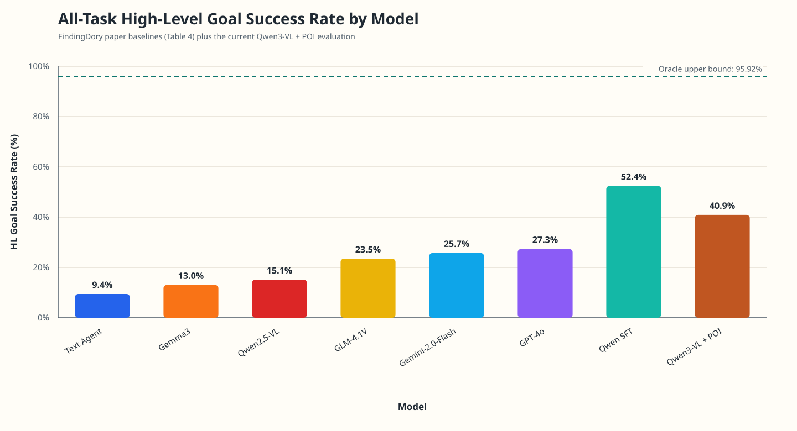
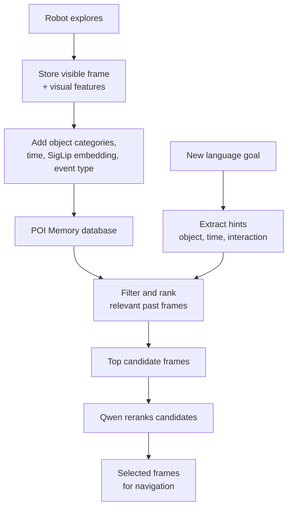
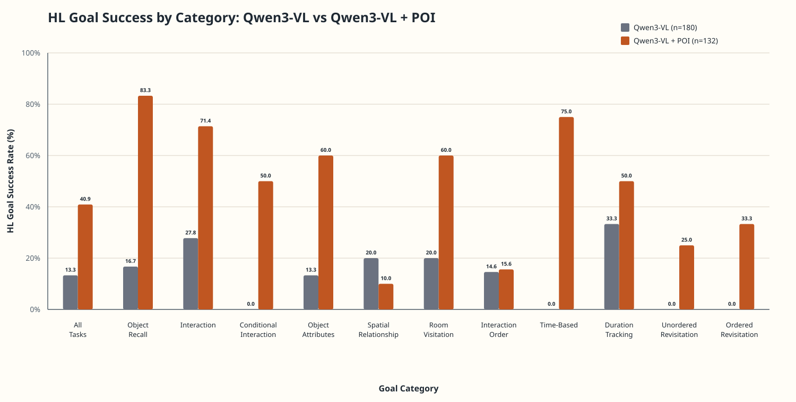

In the previous blog, I had explored finding-dory, a robotic eval that tested the in-context recall memory of Vision-Language models. Real-world robots will experience larger multiples of this context throughout operation. To effectively remember the places of interest, a system of record is required. 

I have built this memory layer , named POIMemory, which boosts the performance on finding-dory to be near SOTA (beaten only by SFT on the dataset). Memories objects are generated which contains the frame, timestamp, objects, etc and through a series of ranking steps the correct memory is retrieved according to the user instruction.



Finding dory is a robotic evaluation dataset that tests the in-context memory recall during an indoor, navigation session of a robot. The robot receives camera frames as input. After manually exploring an apartment in the habitat simulator, navigation goals are given to the model that test its recall ability from the initial exploration sessions. These goals are in the text for e.g. "Navigate to a chest of drawers.", "Navigate to the object that you interacted with at XX:XX yesterday." , "Navigate to a cylindrical shaped object that you interacted with yesterday.". "Navigate to a table you placed an object on." etc. 

The main metrics measured are High level goal success rate (HL goal SR) : Whether the model selects the correct frame(s) that contain the locations of the given goal. Task success rate (Task SR): Whether the robot navigates to all targets successfully in the simulator.  

POIMemory turns the robot’s past observations into a searchable visual memory. As the robot moves, it stores each visible frame with visual features, detected object categories, time-of-day, depth, and whether it was navigating or manipulating an object. When a new instruction arrives, it narrows this memory using temporal hints, ranks the most relevant frames, and asks Qwen to choose the final frame(s) from that small candidate set. It uses only robot-visible observations, not ground-truth task labels or global scene information. The simulator provides segmented object labels. 


  

- While exploring, the agent saves a compact record for every robot-visible frame.
- Each record includes visual appearance, visible object/receptacle categories, time-of-day, and a simple interaction-event label.
- It gets the object categories from simulator-provided segmentation generated from scene geometry

POIRecord
```json
{
  "frame_index": 123,
  "time_of_day": "morning",
  "rgb_embedding": [0.0123, -0.0456, 0.0789],
  "entity_categories": [
    "chair",
    "table",
    "sofa"
  ]
}
```
EventRecord
```json
{
  "frame_index": 123,
  "manipulation_mode": false,
  "event_type": "navigation",
}
```
- On a new goal, it looks for useful hints such as the requested object, a time cue like “morning,” or actions like “pick” and “place.”
  - Based on the time queue, only frames from the relevant time periods are selected as the starting pool. e.g. morning, early, late etc.
- It filters the stored frames, then scores them by visual similarity, category match, temporal relevance, and interaction context. An embedding score is also calculated from the similarity of the query embedding and the stored-frame embedding using SigLip 2
  - For example: manipulation events get +0.25 if the goal had that interaction mentioned. 
- It keeps a diverse set of high-scoring candidates rather than many nearly identical frames.
  - A rarity boost (IDF) is given based on object categories. Common categories such as `chair` or `table` receive only a small bonus. This ensures that noisy frames do not dominate the candidate sets.
- Qwen sees only these candidate images and their metadata, then selects the frame indices most likely to satisfy the goal.
- The system deliberately avoids oracle labels, PDDL goals, and global simulator state during retrieval.

The best evaluation run was tested using Qwen 3 VL 8B Instruct.



Here is a report for a few episodes which shows which tasks it was able to complete. 

<iframe src="/resources/poi_report/findingdory_partial_metrics_view.html" width="100%" height="600" title="FindingDory metrics report" frameBorder="0" allowFullScreen loading="lazy"></iframe>

Memory is really crucial for human-robot interactivity. While VLMs excel at accomplishing singular tasks, the memory layer is what glues the tasks, human requests and environment together. I will be exploring more techniques to improve this component of the robot stack.

Thank you to Karmesh Yadav et al. for building [finding-dory](https://arxiv.org/pdf/2506.15635), Abrar et al. for [Remembr](https://nvidia-ai-iot.github.io/remembr/) for initial robotic memory systems.

### Cite this blog

Zaidi, H. (2026, July 19). *POIMemory: A Robotic Memory Harness*. HHZ Blog. https://husain-zaidi.github.io/poi-robot-memory/

```bibtex
@misc{zaidi2026poimemory,
  author = {Husain Zaidi},
  title = {POIMemory: A Robotic Memory Harness},
  year = {2026},
  month = jul,
  publisher = {HHZ Blog},
  url = {https://husain-zaidi.github.io/poi-robot-memory/}
}
```
