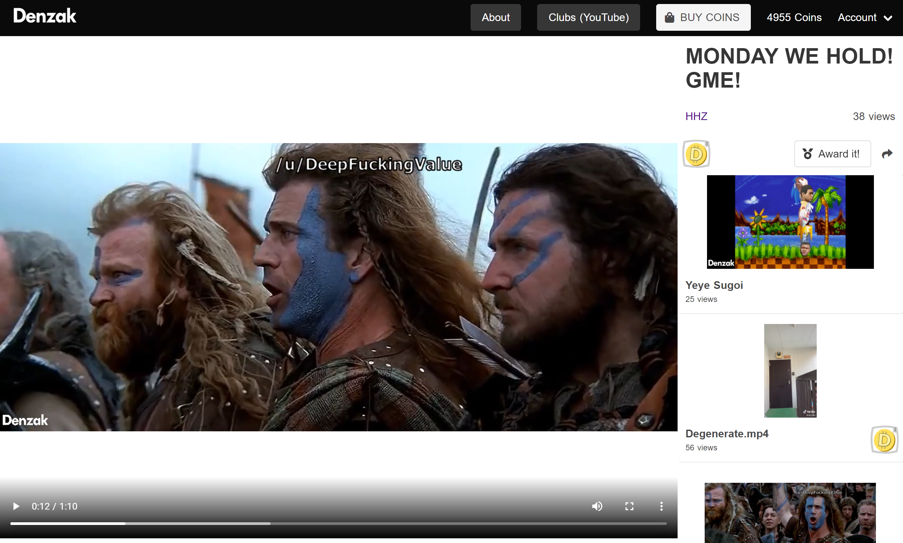
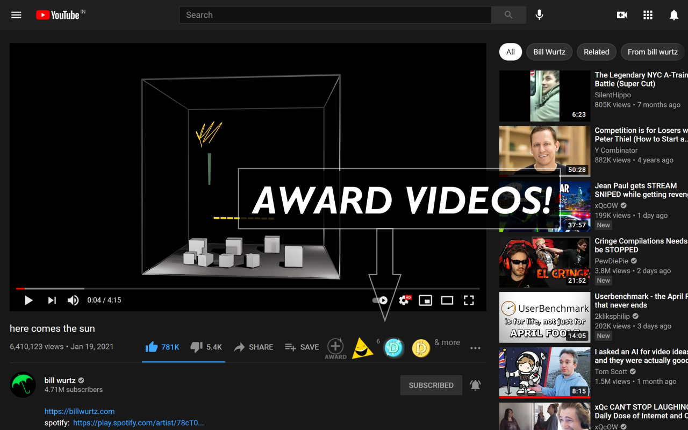
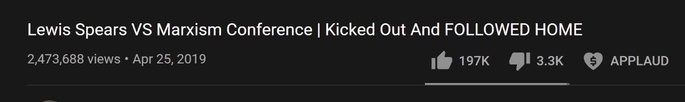
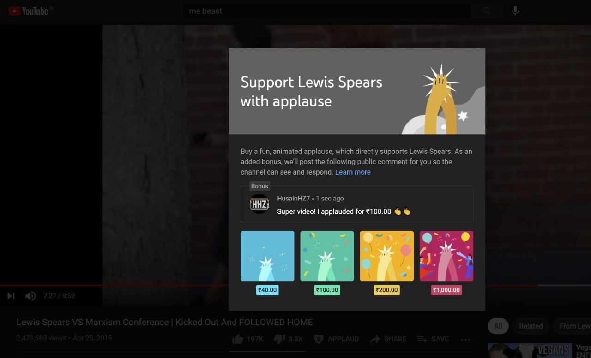

My new year resolution was to make a project that achieves some sort of product-market-fit. 

I did some prospecting (just like the old days) looking into existing ecosystems. Being a huge YouTube consumer, the creator economy was always interesting for me. For years, YouTubers have been voicing their concerns about the platform shifting its emphasis to longer videos, leaving the shorter, higher quality videos not receiving much ad revenue. My idea was to introduce a per-video "awards" system that would allow fans to 'tip' a video, thus bringing revenue for shorter content. It will show a small badge besides the video, just like awarding a reddit post. And thus was born [Denzak](https://denzak.onrender.com).

At first, I went ahead and created a complete YouTube clone focussing on meme channels. Built using Nuxt, Node, Mongo. I tacked on FTP with node to store and stream the video files from a DigitalOcean droplet. Its an MVP after all. This had the complete implementation of the awards system. After initial talks with some Instagram pages, it became clear that achieving a large audience was their number one goal. Why would they post at my place after all? They'd waste time  It was time to pivot.

Since my targets were YouTube channels, I got the idea to create a chrome extension that allowed viewers to award YouTube video! This extension inserted the awards just below the video. A popup appears if you click the 'award video' button, allowing you to choose the award. I even added a random award drop whenever you awarded a video. Just at the start of April, it got accepted in the [Chrome Web Store](https://chrome.google.com/webstore/detail/denzak-award-youtube-vide/bjmbckhgkdddfmflihkcndelgklpeeoi). 

I liked this integration and thought it would be a value add. Collaborating with YouTubers would increase usage, as they'd urge fans to hype up the video. I struggled a while getting people's attention, despite posting in several Youtuber-oriented subreddits and discord servers. It felt like I wasn't solving a pressing need. Should've listened to my thoughts then.

Days later as a I was leisurely watching videos, My eyes caught onto a similarly placed button.

They've had the same idea! Instead of badges they're highlighting comments, the soul of the idea was there. It was interesting that they began AB testing it right around the time I released Denzak. The idea for "applause" has been in development since [last year](https://www.theverge.com/2020/2/12/21134512/youtube-viewer-applause-clapping-feature-monetization-creators-twitch-donations). Had I been in their test ring earlier, I would've stopped Denzak. Per-video donations are coming, and it is being done by the hosts themselves. No one can compete with the first party.

My learnings:
1. Research the need you are willing to serve in the market. I chose this idea based on the fact that I knew, sooner or later, this was going to be implemented. I was surprised that it hadn't been implemented by the time I started working on it. As seen above, YouTube seems to agree with me.
2. Serve a pressing need. YouTube and every other social media platform has started focussing on short videos. Monetization and discovery for these videos has improved a lot. So my extension wasn't adding much value to the ecosystem. I should've worked on solving a bigger problem
3. Avoid depending too much on an existing system. The host can always swallow you up by implementing it themselves. They will have troves of User data to base their product decisions on, making them faster and more effective.

I am still interested in the creator economy, searching for more opportunities. Happy to have a talk if anyone's interested.
